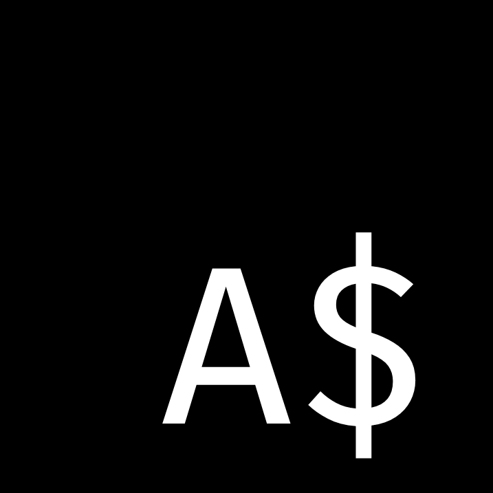

> ⚠️ License Note: ArachnoScript and its binaries may be used, shared, and modified
> for personal, educational, or non-commercial purposes only. Commercial use,
> sale, or distribution requires explicit written permission from the author.


# ArachnoScript

<p>
ArachnoScript is a programming language that I,
<span style="color: yellow">ECMA King</span> as I like to call myself,
designed and built from scratch.
</p>

ArachnoScript is inspired by JavaScript, created by Brendan Eich.

<p>
You would think, as the name implies, that it is an interpreted language —
and that is true. Only for now.
</p>



<b>
ArachnoScript is similar to JavaScript (my favourite language) in many ways,
from the syntax and semantics to how things work underneath.
But it wouldn't be a different language if there was no difference between the two.
</b>

# Getting Started

Before diving into how AS works:

Download the ZIP file for your operating system and CPU architecture

1. Unzip the archive
2. Open a terminal in the extracted directory
3. Start writing code in the provided AS program
4. Run the appropriate command for your platform

> linux-amd\
> linux-arm\
> mac-amd\
> mac-arm\
> windows

---

<h2>The ARE (ArachnoScript Runtime Environment)</h2>

ARE includes a REPL, though it is currently minimal. ⚠️ Output is not implicit
in the REPL because I didn't put much work into it. You must explicitly print
values to see them.

## Syntax Overview

> Note: It may be weird but comments are not supported, at all.

<h2>Variable Declarations</h2>

```js
$ single line comment

$ mutable variable
spawn variable = 0; $ optional semicolon. If you love yourself, make sure you add it.

$ constant variable
immortal spawn constant = "super";

$ static variables
$ these variables cannot be changed in any way unless changed internally
static spawn completely_static = { yo: 20 }; $ JavaScript object literal syntax

constant = "cool"; $ syntax error
completely_static.yo = 30; $ syntax error

$ the var keyword is supported but is no different from spawn
var pointless = true;
```

<h2>Functions</h2>

```js
$ same old JavaScript
function add(x, y) {
  return x + y;
}

add(1, 2); $ 3

$ async functions!
async function Later(message) {
  Console.log(message); $ I had to change it
  return message;
}

spawn message = Later("now");
$ it returns a promise!
Console.log(message); $ Promise {}

message.then((value) => {
  Console.log(value, "then"); $ 😎
});

$ .catch() and .finally() are currently unsupported.
```

<h2>Object Semantics (Important Difference from JS)</h2>
JavaScript passes object references by value, which allows mutation of the original object.
ArachnoScript does not — by default.

```js
function SetObject(object) {
  object = {};
  Console.log(object); $ {}
}

spawn object = { key: "prop" };
SetObject(object);
Console.log(object); $ { key: "prop" }
```

Function parameters in AS are <b>deep-copied.</b>

However:

```js
spawn object2 = object;
object2.key = 10;
Console.log(object); $ { key: 10 }
```

Assignments create shared references.

<h2>Data Types</h2>

ArachnoScript data types are not identical to JavaScript’s.

```ts
number    | same as JS
string    | same as JS
boolean   | same as JS
object    | similar to JS
array     | special array type
function  | similar to JS
class     | special class type
instance  | special instance type
symbol    | similar to JS
null      | similar to JS
undefined | similar to JS
macro     | special function type
raw       | special value type
```

These extra types exist to solve runtime ambiguity (e.g. constructors vs
objects).

### Literals and Examples

```js
(1, 10, 1000, 1.2, 4.7); $ numbers
("super", 'cool'); $ supported strings
(true, false); $ booleans

({
  foo: {
    1: 0,
    2: 3
  } $ optional comma, but it can come back to hit you later
  bar: {
    "key": true
  }
  [1 * 2]: 3
}); $ objects
```

Arrays:

1. Have no methods
2. Support indexing
3. Behave closer to C / Go arrays

```js
[2, 3, 4, "5", '6']; $ AS arrays
[2][0]; $ valid
[2][-1]; $ valid
$ support assignments;
[][0] = "element";
$ support destructuring and spread syntax (...)
```

```js
(() => {}, function () {}); $ functions

null;
undefined;

$ symbols
Symbol("my symbol");

#_print("power"); $ macro

$ raw values cannot be created using literals
$ and are usually not exposed by functions from the std lib
```

<h2>Classes, Inheritance and Instances</h2>

```js
spawn Constructor = class {
  private prop = "still accessible (for now)";

  constructor() {
    Console.log(this.prop);
  }

  function method() {}
};

spawn instance = new Constructor();

class Person {
  public name = "anonymous";
  constructor(name) {
    this.name = name;
  }
  greet() {
    Console.log("Hi! this is", this.name);
  }
}

class ECMAKing extends Person {
  constructor(name) {
    super("ECMA King");
  }
  greet() {
    Console.log("Yo, I am", this.name);
  }
}

spawn ecmaking = new ECMAKing();
ecmaking.greet();

spawn person = new Person();
person.greet();
```

<h2>Keywords</h2>

Keywords cannot be used as:

- variable names
- property names
- method names

(This restriction may be relaxed later.)

<h2>Keyword List</h2>

```js
var | spawn | immortal | static |
function | class | constructor |
if | else | break | continue | switch | case | default |
do | while | for |
throw | return |
try | catch | finally |
import | export | from | 
globalThis |
in | of | instanceof | typeof | void |
super | new | await | match
```

<h2>Control Flow</h2>

```js
if (true) {
  Console.log("yes");
} else {
  Console.log("no");
}

spawn value = 30;

if (match value { 30 => true }) {
  Console.log(value);
}
```

<h2>Loops and Iteration</h2>

```js
for (i = 0; i <= 10; i++) {
  Console.log(i);
}

$ Iteration
for (const key in iterable) {
  Console.log(key);
}

for (const value of iterator) {
  Console.log(value);
}
```

Supported types:

1. objects
2. arrays
3. instances (with Symbol.iterator method)
4. strings (only in for..of loop)

<h2>Standard Library</h2>

AS includes a standard library designed to feel familiar to JavaScript users.

<h3>Hello World</h3>

```js
Console.log("Hello", "World!");
```

<h2>Arrays</h2>

```js
spawn myArray = [0, 1, 3];

Console.log(#_array_length(myArray));

myArray[2] = 2;
```

<h2>Math</h2>

```js
spawn number = 25;

number += 30;
number /= 15;
number *= 5;

Console.log(number ** 2);
Console.log(number % 2);
```

<h2>Strings</h2>

```js
spawn string = "I love programming.";
string += " It's challenging";

Console.log(string);

spawn object = new String(string);
Console.log(object.length);
```

<h1> Web Development & Servers </h1>

ArachnoScript includes a web-focused standard library called Verdex.

Verdex allows building web applications using: **AS & ASX (similar to JSX)**

AS code is compiled to JavaScript.

> ⚠️ Verdex is experimental and limited.

<h2>Creating a Server</h2>

```js
immortal spawn server = new http.Server(":4567");

server.HandleFunc("/", function (writer, request) {
  writer.writeString("Yo, it's AS by the way.");
});

server.HandleFunc("/{id}", function (writer, request) {
  writer.writeString(request.pathValue("id"));
});
$ anyone recognise this?
server.listenAndServe(); $ prints server running on http://localhost:4567
```

<h2>Verdex + ASX</h2>

```js
spawn app = new Verdex.WebApp("path-to-html");
app.run();
```

<h2>Required HTML Format</h2>

```html
${./main.asx}$

<!DOCTYPE html>
<html>
  <head>
    <title>Your page title</title>
  </head>
  <body></body>
</html>
```

<h2>ASX Module</h2>

```jsx
component Button {
  spawn i = 0;
}

<button>${i}$</button>

component Home

<div>Hello from ASX!</div>
<Button />
```

Open the printed address in your browser to see:

“Hello from ASX!” and a rendered button
